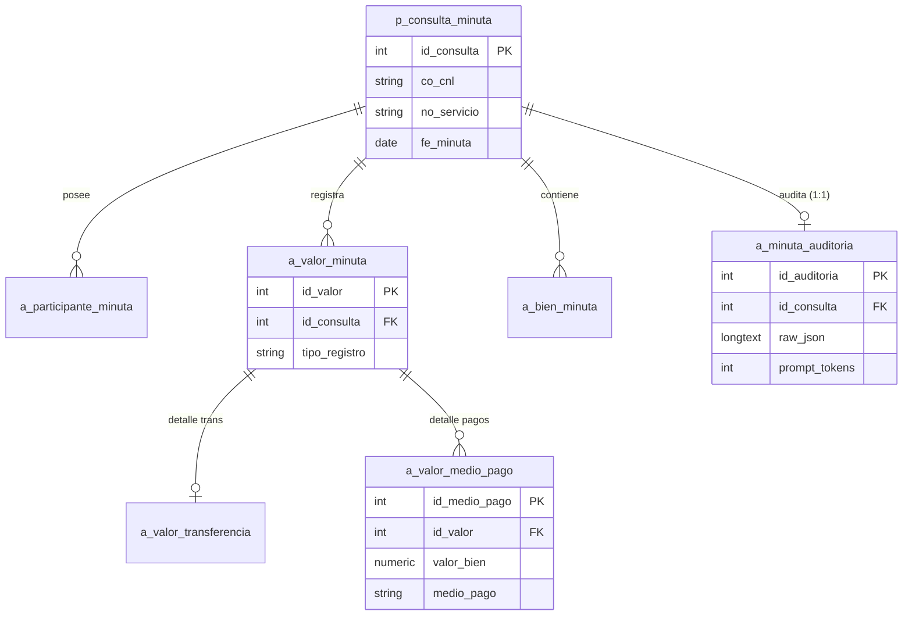

# 🚀 Minutas-IA Extraction Engine

Este repositorio es el núcleo de procesamiento de minutas notariales peruanas. Utiliza Inteligencia Artificial (OpenAI) combinada con una capa de resiliencia y normalización de negocio para garantizar datos estructurados de alta calidad.

---

## 📌 Mapa de Procesamiento (The Engine Pipeline)

Para integrar este motor (vía WebSocket o API), es fundamental entender las capas por las que pasa la data:

### 1. Extracción (OpenAI Layer)
- **Motor**: `gpt-4o-mini` (determinado en `.env`).
- **Input**: Texto plano normalizado de PDF/DOCX.
- **Output**: JSON con 4 raíces: `acto`, `participantes`, `valores`, `bienes`.
- **Reglas**: Se aplican `Service Rules` dinámicas según el tipo de acto (ej. CONSTITUCIÓN).

### 2. Capa de Resiliencia: JSON Repair (CRÍTICO)
Debido a la longitud de los textos (ej: objetos sociales gigantes), el LLM a veces devuelve un JSON "colapsado" (una lista mixta de objetos y fragmentos de texto).
- **Lógica**: `app/utils/json_utils.py` -> `repair_collapsed_json`.
- **Función**: Reconstruye la jerarquía anidada (`documento`, `domicilio`) usando un sistema de **Stacks** que "cose" los fragmentos sueltos.

### 3. Normalización de Dominio
Una vez reparado, el payload pasa por `normalize_payload` (`app/utils/parsing/payload.py`):
- **Mayúsculas**: Conversión recursiva de todo el payload a `UPPERCASE`.
- **Catálogos**: Mapeo automático de `CIIU`, `Países`, `Ocupaciones` y `Estado Civil`.
- **Ubigeo**: Inferencia de ubicación basado en departamentos peruanos.
- **Finanzas**: Reconciliación entre la tabla de `transferencia` y `medio_pago`.

### 4. Persistencia Master-Detail (MER)
La base de datos utiliza una jerarquía de 3 niveles para evitar pérdida de información financiera:

1. `p_consulta_minuta`: Cabecera histórica.
2. `a_valor_minuta`: Agrupador maestro de operaciones financieras.
3. `a_valor_transferencia` / `a_valor_medio_pago`: Detalles específicos vinculados al maestro.

### 5. Auditoría "Black Box" (Caja Negra)
Cada extracción deja rastro en **`a_minuta_auditoria`**:
- Almacena el **`raw_json`** (el texto exacto que escupió la IA antes de ser reparado).
- Registra **Tokens** (Prompt/Completion) y **Latencia (ms)**.
- Útil para post-mortem y tuning de prompts.

---

## 🛠️ Guía de Diagnóstico y Tests

Para validar que el motor está operando correctamente después de una actualización:
1.  **Ejecutar Validaciones**: `python tests/test_extraction_validation.py`
2.  **Verificar Auditoría**: Consultar la tabla `a_minuta_auditoria` para ver el desempeño del modelo.

## 📂 Mapa del Repositorio (Key Files)
- `app/services/minuta_service.py`: Orquestador del pipeline completo.
- `app/repositories/minuta_repository.py`: Lógica de persistencia Master-Detail.
- `app/utils/json_utils.py`: Lógica de reparación de JSON fragmentado.
- `app/utils/parsing/payload.py`: Normalizador de lógica de negocio.
- `app/models/minuta.py`: Modelos SQLAlchemy (Esquemas de DB).